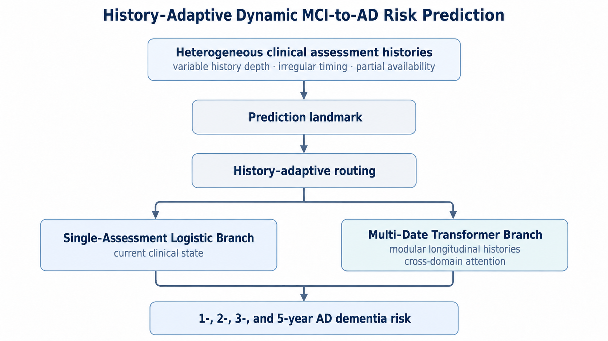

# Dynamic MCI-to-AD Risk Prediction Using Routine Clinical Assessments

**A history-adaptive framework for dynamic MCI-to-AD risk prediction from routine clinical assessments, developed on ADNI and externally validated on NACC.**

The framework uses demographic, cognitive, and functional assessments without requiring PET, CSF biomarkers, MRI, or genetic testing, making it suitable for primary-care, community, and resource-constrained settings.

[Open the model-backed research demo](https://huggingface.co/spaces/reylii/MCI-to-Alzheimers-Dementia-Risk-Assessment)

> **Research use only.** Not for clinical use. Do not enter real patient information.

---

  

## Design highlights

- **History-adaptive routing.** One assessment date → regularized discrete-time logistic regression; two or more dates → temporal Transformer.
- **Modular longitudinal modeling.** Irregular domain-specific histories are encoded independently and integrated across available domains.
- **Partial assessment availability.** Unavailable domains are masked rather than reconstructed as synthetic clinical measurements.

The framework produces repeatedly updated **1-, 2-, 3-, and 5-year risks** within a landmark-based discrete-time survival formulation.

## Results at a glance

| Evaluation | Participants | Dynamic landmarks | AUROC |
|---|---:|---:|---:|
| ADNI internal out-of-fold evaluation | 1,425 | 4,223 | 0.815–0.887 |
| **NACC frozen external validation** | **12,052** | **26,303** | **0.719–0.778** |

The NACC evaluation used ADNI-fitted preprocessing and the frozen development model, with **no retraining, tuning, preprocessing refitting, or recalibration before primary external evaluation**.

---

## Method

### Dynamic prediction using landmarking

Eligible **MCI diagnosis dates**, thinned to a minimum 180-day interval within each participant, define prediction landmarks. Only information observed on or before each landmark is used for prediction.

Risk can therefore be updated as additional clinical information becomes available.

### History-adaptive routing

Branch assignment depends on the number of distinct valid assessment dates available up to the prediction landmark:

| Available history | Prediction branch |
|---|---|
| One assessment date | **Single-Assessment Logistic Branch** |
| Two or more assessment dates | **Multi-Date Transformer Branch** |

History depth is defined across all available assessment domains; repeated measurements of every individual scale are not required for the Transformer route.

The logistic branch is fitted specifically on single-assessment landmarks. The Transformer is trained using **all development landmarks** and selectively deployed for multi-date histories.

### Modular longitudinal modeling

The framework represents five cognitive and functional assessment domains:

**ADAS13 · MMSE · global CDR · CDR-SB · FAQ**

Each domain retains its own irregular longitudinal sequence rather than being aligned to a common visit grid.

A shared temporal encoder is applied independently to each domain-specific history. Each module representation combines longitudinal context with the latest observed measurement, after which available modules are integrated with demographic information through **masked cross-domain fusion**.

### Partial assessment availability

The framework does not require all assessment domains to be present.

Unavailable domains are excluded from model fusion rather than reconstructed as synthetic measurements. During training, entire assessment domains are additionally masked to expose the model to reduced-input settings.

This supports prediction when some assessment domains are unavailable, without requiring their reconstruction or imputation.

### Discrete-time survival output

Both branches estimate conditional hazards over four intervals:

**0–1 · 1–2 · 2–3 · 3–5 years**

Cumulative risk through interval \(m\) is

$$
R_m = 1-\prod_{k\le m}(1-h_k)
$$

yielding 1-, 2-, 3-, and 5-year risks of progression to AD dementia at each prediction landmark.

---

## Evaluation

### Internal evaluation in ADNI

Development performance is estimated using **patient-grouped fivefold out-of-fold prediction**, with all landmarks from the same participant assigned to the same fold.

Landmark contributions are participant-balanced so that individuals with denser follow-up do not dominate evaluation through repeated observations.

Performance is assessed using IPCW-based horizon-specific AUROC, AUPRC, and Brier scores, together with calibration analyses and patient-level bootstrap uncertainty estimates.

### Frozen external validation in NACC

The frozen ADNI-developed framework was applied to **12,052 NACC participants and 26,303 dynamic landmarks**.

No compatible ADAS13 measurement was available in the **NACC extract used for external validation**, so predictions were generated under the prespecified no-ADAS13 scenario using the remaining available assessment domains.

| Horizon | ADNI AUROC | ADNI AUPRC | ADNI Brier | NACC AUROC | NACC AUPRC | NACC Brier |
|---|---:|---:|---:|---:|---:|---:|
| 1 year | 0.815 | 0.332 | 0.0869 | 0.719 | 0.123 | 0.0556 |
| 2 years | 0.844 | 0.641 | 0.1366 | 0.733 | 0.441 | 0.1756 |
| 3 years | 0.861 | 0.761 | 0.1463 | 0.759 | 0.619 | 0.2042 |
| 5 years | 0.887 | 0.877 | 0.1378 | 0.778 | 0.762 | 0.2024 |

The frozen model retained discrimination across prediction horizons in NACC but showed systematic longer-horizon underprediction of absolute risk.

### Calibration and model updating

A separate patient-level cross-fitted model-updating analysis evaluated **recalibration-in-the-large** and **logistic recalibration**.

Mean horizon Brier score decreased from **0.1594** for frozen predictions to **0.1513** after recalibration-in-the-large and **0.1494** after logistic recalibration.

Because NACC outcomes were used to estimate recalibration parameters, these results are treated as **target-population model updating**, not independent external validation.

[Detailed recalibration analysis](reports/public/external/nacc_recalibration/README.md)

---

## Public implementation

This repository provides the public implementation of the **data representation, history-adaptive routing, model architecture, and survival-risk calculation** used in the final framework.

Synthetic examples and automated tests are included.

---

## Contact

**Qirui Li**  
GitHub: [rey-Lii](https://github.com/rey-Lii)  
Email: liqirui019@gmail.com
